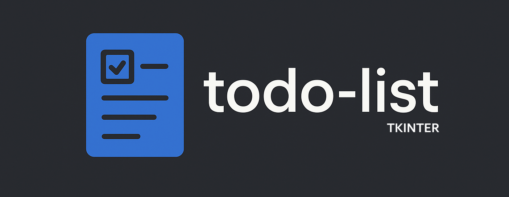
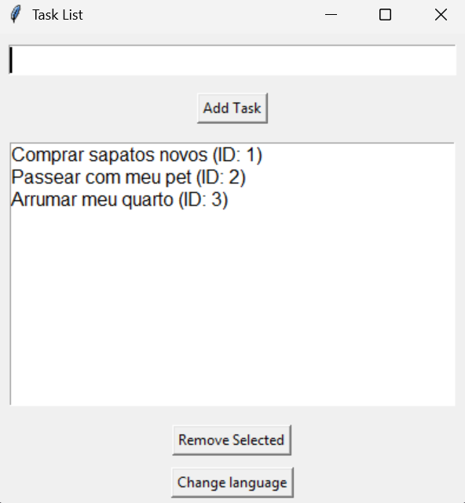
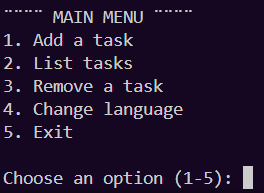

<div align="center">
  <picture>
    
  </picture>
</div>

<div align="center">
  <h1>To-Do List Project (Terminal & GUI)</h1>
</div>

This repository contains two Python-based to-do list applications, both with a user interface in **Portuguese** but code and commits in **English**, designed for learning and practical usage.

## Screnshots

> todo-list Tkinter Version


> todo-list Terminal Version


## Project Structure

```
todo-list/
│
├── todo_list/
│   ├── todo_terminal.py          # Terminal-based version (chat-style interface)
│   └── todo_tkinter.py           # GUI version using Tkinter
│
├── tests/
│   └── test_todo.py              # Pytest
│
├── img/
│    ├── logo.png                 # Logo for README
│    ├── screenshot-terminal.png  # Terminal screenshot for Readme
│    └── screenshot-tkinter.png   # Tkinter screenshot for Readme
├── .gitignore                    # Simple gitignore
├── CHANGELOG.md                  # All changes
├── README.md                     # Project documentation

```

---

## Features

### Terminal Version (`todo_list_terminal.py`)
- Add, list, and remove tasks via terminal
- Clear input validation and error messages
- Infinite menu loop until user exits

### GUI Version (`todo_list_tkinter_gui.py`)
- Clean and minimal Tkinter interface
- Add task via text input
- Remove selected task from the list
- Auto-refreshes task list when modified

---

## Requirements

- Python 3.x (recommended: 3.8+)
- No external libraries needed (only built-in modules)

---

## How to Run

### Terminal version:
```bash
python todo_list_terminal.py
```

### GUI version (Tkinter):
```bash
python todo_list_tkinter_gui.py
```

---

## Notes

- The interface language is **Portuguese**, but all code, commits, and documentation are in **English**.
- You can expand this project by adding save/load features using JSON or text files.


---

## License

This project is licensed under the MIT License.  
See the [LICENSE](LICENSE) file for details.

---

## Author

**Lucas Alcântara**  
GitHub: [@A1cantar4](https://github.com/A1cantar4)